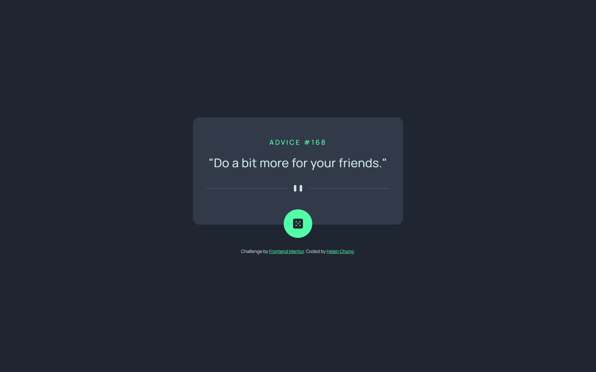
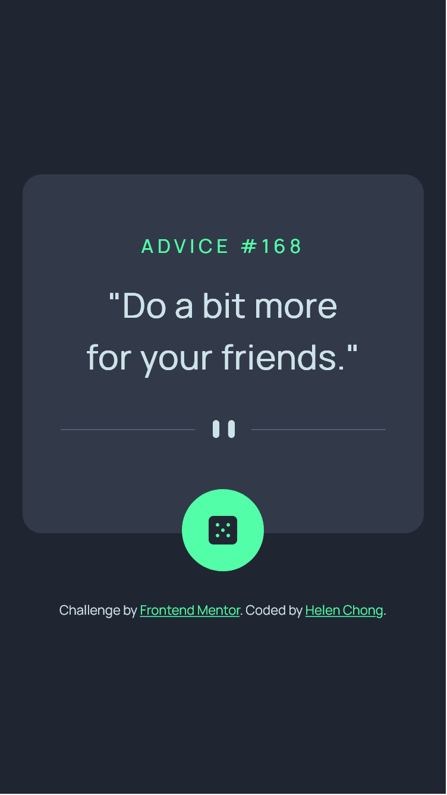

# Frontend Mentor - Advice generator app solution

This is a solution to the [Advice generator app challenge on Frontend Mentor](https://www.frontendmentor.io/challenges/advice-generator-app-QdUG-13db). Frontend Mentor challenges help you improve your coding skills by building realistic projects.

## Table of contents

- [Overview](#overview)
    - [The challenge](#the-challenge)
    - [Screenshot](#screenshot)
    - [Links](#links)
- [My process](#my-process)
    - [Built with](#built-with)
    - [What I learned](#what-i-learned)
    - [Continued development](#continued-development)
    - [Useful resources](#useful-resources)
- [Author](#author)
<!-- - [Acknowledgments](#acknowledgments) -->

## Overview

### The challenge

Users should be able to:

- View the optimal layout for the app depending on their device's screen size
- See hover states for all interactive elements on the page
- Generate a new piece of advice by clicking the dice icon

### Screenshot

Desktop:


Mobile:


### Links

- Solution URL:
- Live Site URL: https://helenclx.github.io/Frontend-Mentor-Challenges/advice-generator-app/

## My process

### Built with

- Semantic HTML5 markup
- CSS custom properties
- Flexbox
- Mobile-first workflow
- [Advice Slip API](https://api.adviceslip.com/)

### What I learned

This challenge allowed me to practice building a project that involves fetching data from an API.

In my research when I was building this project, I learned that Firefox cache the response from the API, Therefore, to ensure the advice generator button works on Firefox, pass a `{cache: "no-cache"}` object as the second argument of the fetch API.

```js
fetch('API_URL', {cache: "no-cache"})
```
(Source: https://stackoverflow.com/a/73145659)

### Continued development

I would like to make use of my knowledge and skills of fetching API data to build more projects based on it.

### Useful resources

- [How to Fetch Data from an API Using the Fetch API in JavaScript](https://www.freecodecamp.org/news/how-to-fetch-data-from-an-api-using-the-fetch-api-in-javascript/) by freeCodeCamp
- [Using the Fetch API](https://developer.mozilla.org/en-US/docs/Web/API/Fetch_API/Using_Fetch) by MDN Web Docs

## Author

- Website - [Helen Chong](https://helenclx.github.io/)
- Frontend Mentor - [@helenclx](https://www.frontendmentor.io/profile/helenclx)

<!-- ## Acknowledgments

This is where you can give a hat tip to anyone who helped you out on this project. Perhaps you worked in a team or got some inspiration from someone else's solution. This is the perfect place to give them some credit. -->