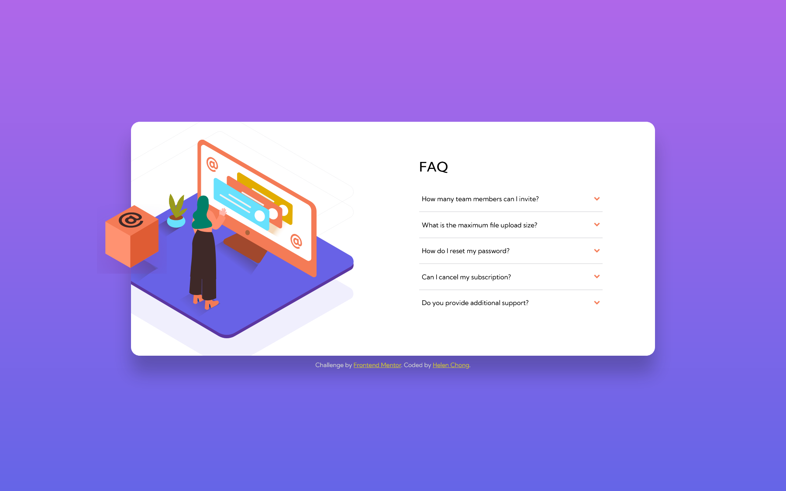

# Frontend Mentor - FAQ accordion card solution

This is a solution to the [FAQ accordion card challenge on Frontend Mentor](https://www.frontendmentor.io/challenges/faq-accordion-card-XlyjD0Oam). Frontend Mentor challenges help you improve your coding skills by building realistic projects. 

## Table of contents

- [Overview](#overview)
    - [The challenge](#the-challenge)
    - [Screenshot](#screenshot)
    - [Links](#links)
- [My process](#my-process)
    - [Built with](#built-with)
    - [What I learned](#what-i-learned)
    - [Continued development](#continued-development)
    - [Useful resources](#useful-resources)
- [Author](#author)
- [Acknowledgments](#acknowledgments)

## Overview

### The challenge

Users should be able to:

- View the optimal layout for the component depending on their device's screen size
- See hover states for all interactive elements on the page
- Hide/Show the answer to a question when the question is clicked

### Screenshot

Desktop:  


Mobile:  


### Links

- Solution URL: https://www.frontendmentor.io/solutions/faq-accordion-card-without-javascript-42vn9Q9lsO
- Live Site URL: https://helenclx.github.io/Frontend-Mentor-Challenges/faq-accordion-card/

## My process

### Built with

- Semantic HTML5 markup
- CSS custom properties
- Flexbox
- CSS pseudo element
- Mobile-first workflow

### What I learned

I learned to make an FAQ accordion without using JavaScript by using and styling the `<details>` and `<summary>` elements.

Sample HTML:
```html
<details>
    <summary>Question</summary>
    <div>Answer</div>
</details>
```

The most challenging part of this challenge is positioning the images. After a lot of research, I settled for creating a pseudo-element with the `::before` selector in CSS, setting the images as background images, and then using multiple CSS properties to position the images.

I got to practice using CSS's `transform` property to rotate an image, by making the arrow image rotate 180 degrees when opening a question's answer, and the `animation` property to animate the content of the accordion when it is opened.

### Continued development

Use this section to outline areas that you want to continue focusing on in future projects. These could be concepts you're still not completely comfortable with or techniques you found useful that you want to refine and perfect.

### Useful resources

- [`<details>`: The Details disclosure element - HTML: HyperText Markup Language](https://developer.mozilla.org/en-US/docs/Web/HTML/Element/details) by MDN Web Docs
- [`<summary>`: The Disclosure Summary element - HTML: HyperText Markup Language](https://developer.mozilla.org/en-US/docs/Web/HTML/Element/summary) by MDN Web Docs
- [Pure HTML accordion with details and summary elements](https://nikitahl.com/native-html-accordion) by Nikita Hlopov
- [::before - CSS: Cascading Style Sheets](https://developer.mozilla.org/en-US/docs/Web/CSS/::before) by MDN Web Docs

## Author

- Website - [Helen Chong](https://helenclx.github.io/)
- Frontend Mentor - [@helenclx](https://www.frontendmentor.io/profile/helenclx)

## Acknowledgments

- Robin Rendle - for inspiration for the animation of the opened accordions in this CSS-Tricks article: [Exploring What the Details and Summary Elements Can Do](https://css-tricks.com/exploring-what-the-details-and-summary-elements-can-do/)
- [Albina S](https://www.frontendmentor.io/profile/albina0104) - whose [solution to this challenge](https://www.frontendmentor.io/solutions/solution-without-javascript-gIKXvLmHIO) has inspired my method to position the images