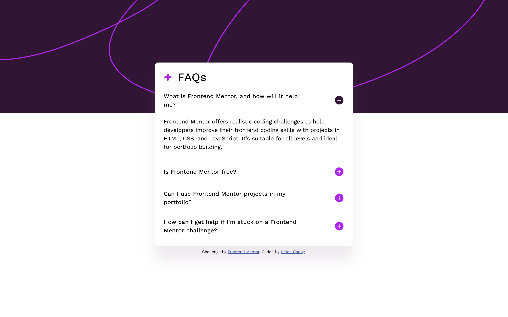
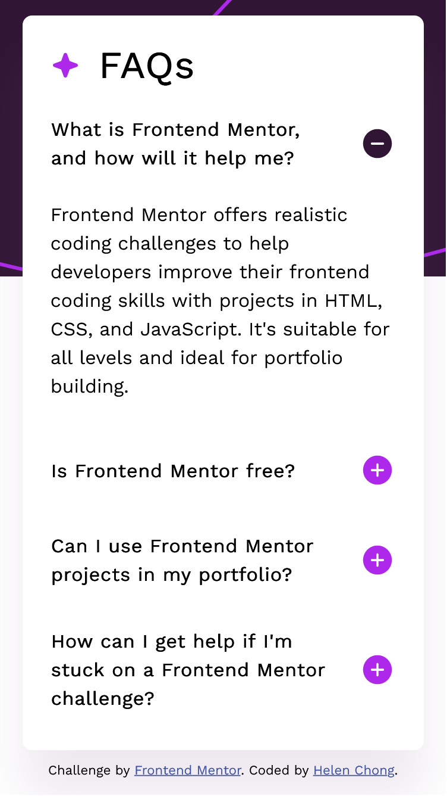

# Frontend Mentor - FAQ accordion solution

This is a solution to the [FAQ accordion challenge on Frontend Mentor](https://www.frontendmentor.io/challenges/faq-accordion-wyfFdeBwBz). Frontend Mentor challenges help you improve your coding skills by building realistic projects.

## Table of contents

- [Overview](#overview)
    - [The challenge](#the-challenge)
    - [Screenshot](#screenshot)
    - [Links](#links)
- [My process](#my-process)
    - [Built with](#built-with)
    - [What I learned](#what-i-learned)
    - [Continued development](#continued-development)
    - [Useful resources](#useful-resources)
- [Author](#author)
<!-- - [Acknowledgments](#acknowledgments) -->

## Overview

### The challenge

Users should be able to:

- Hide/Show the answer to a question when the question is clicked
- Navigate the questions and hide/show answers using keyboard navigation alone
- View the optimal layout for the interface depending on their device's screen size
- See hover and focus states for all interactive elements on the page

### Screenshot

Desktop:


Mobile:


### Links

- Solution URL:
- Live Site URL: https://helenclx.github.io/Frontend-Mentor-Challenges/faq-accordion/

## My process

### Built with

- Semantic HTML5 markup
- CSS custom properties
- Flexbox
- Mobile-first workflow

### What I learned

I got more pract6ice in making an FAQ accordion without using JavaScript by using and styling the `<details>` and `<summary>` elements.

Sample HTML:
```html
<details>
    <summary>Question</summary>
    <div>Answer</div>
</details>
```

In addition, I made use of the `::after` CSS pseudo-element in decorating each question in the FAQ accordion with icons.

### Continued development

I intend to make full use of `<details>` and `<summary>` elements to build accordions.

### Useful resources

- [`<details>`: The Details disclosure element - HTML: HyperText Markup Language](https://developer.mozilla.org/en-US/docs/Web/HTML/Element/details) by MDN Web Docs
- [`<summary>`: The Disclosure Summary element - HTML: HyperText Markup Language](https://developer.mozilla.org/en-US/docs/Web/HTML/Element/summary) by MDN Web Docs
- [Pure HTML accordion with details and summary elements](https://nikitahl.com/native-html-accordion) by Nikita Hlopov
- [::after - CSS: Cascading Style Sheets](https://developer.mozilla.org/en-US/docs/Web/CSS/::after) by MDN Web Docs

## Author

- Website - [Helen Chong](https://helenclx.github.io/)
- Frontend Mentor - [@helenclx](https://www.frontendmentor.io/profile/helenclx)

<!-- ## Acknowledgments

This is where you can give a hat tip to anyone who helped you out on this project. Perhaps you worked in a team or got some inspiration from someone else's solution. This is the perfect place to give them some credit. -->
