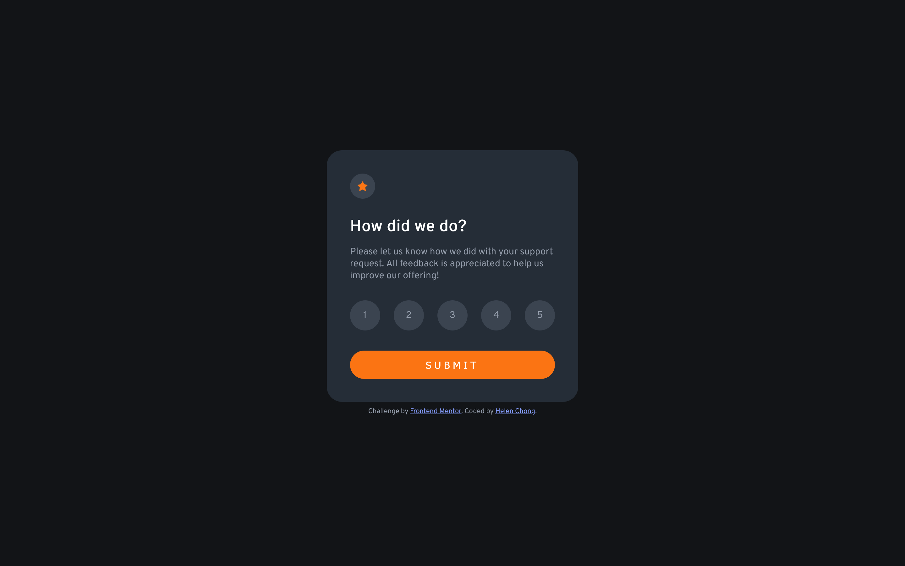
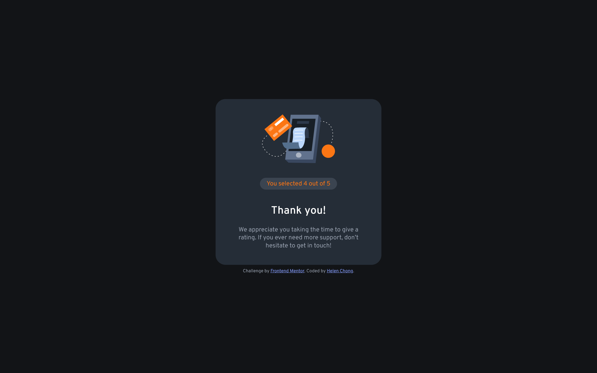
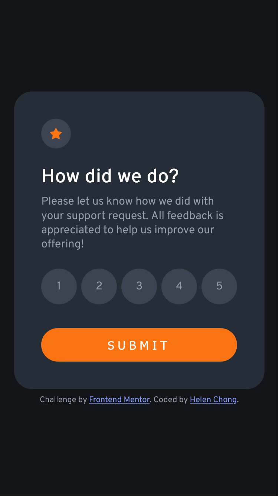

# Frontend Mentor - Interactive rating component solution

This is a solution to the [Interactive rating component challenge on Frontend Mentor](https://www.frontendmentor.io/challenges/interactive-rating-component-koxpeBUmI). Frontend Mentor challenges help you improve your coding skills by building realistic projects. 

## Table of contents

- [Overview](#overview)
  - [The challenge](#the-challenge)
  - [Screenshot](#screenshot)
  - [Links](#links)
- [My process](#my-process)
  - [Built with](#built-with)
  - [What I learned](#what-i-learned)
  - [Continued development](#continued-development)
  - [Useful resources](#useful-resources)
- [Author](#author)
<!-- - [Acknowledgments](#acknowledgments) -->

## Overview

### The challenge

Users should be able to:

- View the optimal layout for the app depending on their device's screen size
- See hover states for all interactive elements on the page
- Select and submit a number rating
- See the "Thank you" card state after submitting a rating

### Screenshot

Desktop:  



Mobile:  


### Links

- Solution URL: https://www.frontendmentor.io/solutions/interactive-rating-component-using-html-css-and-javascript-rfiO0cERCQ
- Live Site URL: https://helenclx.github.io/Frontend-Mentor-Challenges/interactive-rating-component/

## My process

### Built with

- Semantic HTML5 markup
- CSS custom properties
- Flexbox
- CSS Grid
- Mobile-first workflow
- Vanilla JavaScript

### What I learned

I got to practice using JavaScript to add a CSS class with the `Element.classList` property, as well as making a web page interactive through HTML's `onclick` attribute and JavaScript's `addEventListener()` method.

For example:

```html
<button onclick="myFunction()">My Button</button>
```

```js
Element.addEventListener('click', () => {
    // Add web page function here
    comsole.log("Clicked");
});
```

I set up a variable and used `if...else` statement in JavaScript to prevent users from submitting without selecting their rating first.

In addition, I learned to practice the habit of using `console.log()` to check if my JavaScript functions are working as intended, amd cheking the console output in my web browser's developer tool.

### Continued development

I aim to practice my JavaScript skills more to make web pages interactive.

### Useful resources

- [HTML onclick Attribute](https://www.w3schools.com/Tags/att_onclick.asp) by W3Schools
- [HTML DOM Document addEventListener()](https://www.w3schools.com/jsref/met_document_addeventlistener.asp) by W3Schools
- [HTML DOM Element classList](https://developer.mozilla.org/en-US/docs/Web/API/Element/classList) by W3Schools

## Author

- Website - [Helen Chong](https://helenclx.github.io/)
- Frontend Mentor - [@helenclx](https://www.frontendmentor.io/profile/helenclx)

<!-- ## Acknowledgments

This is where you can give a hat tip to anyone who helped you out on this project. Perhaps you worked in a team or got some inspiration from someone else's solution. This is the perfect place to give them some credit. -->