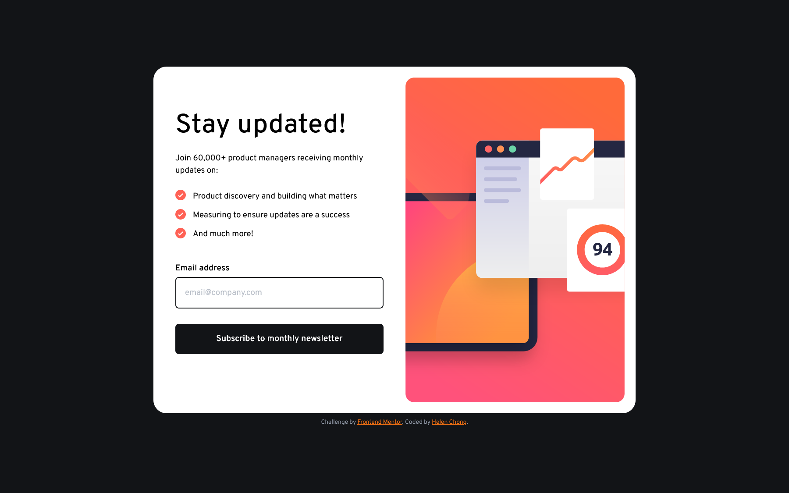

# Frontend Mentor - Newsletter sign-up form with success message solution

This is a solution to the [Newsletter sign-up form with success message challenge on Frontend Mentor](https://www.frontendmentor.io/challenges/newsletter-signup-form-with-success-message-3FC1AZbNrv). Frontend Mentor challenges help you improve your coding skills by building realistic projects. 

## Table of contents

- [Overview](#overview)
    - [The challenge](#the-challenge)
    - [Screenshot](#screenshot)
    - [Links](#links)
- [My process](#my-process)
    - [Built with](#built-with)
    - [What I learned](#what-i-learned)
    - [Continued development](#continued-development)
    - [Useful resources](#useful-resources)
- [Author](#author)
<!-- - [Acknowledgments](#acknowledgments) -->

## Overview

### The challenge

Users should be able to:

- Add their email and submit the form
- See a success message with their email after successfully submitting the form
- See form validation messages if:
    - The field is left empty
    - The email address is not formatted correctly
- View the optimal layout for the interface depending on their device's screen size
- See hover and focus states for all interactive elements on the page

### Screenshot

Desktop:  

Mobile:  

### Links

- Solution URL: 
- Live Site URL: https://helenclx.github.io/Frontend-Mentor-Challenges/newsletter-sign-up-with-success-message/

## My process

### Built with

- Semantic HTML5 markup
- CSS custom properties
- Flexbox
- CSS Grid
- Mobile-first workflow

### What I learned

I got to practice styling lists by using images as the list bullets. I also got more practice in form validation and form styling, including error messages.

### Continued development

I aim to practice form validation and design forms to be both stylish and accessible.

### Useful resources

- [Basic Form Validation in JavaScript](https://www.freecodecamp.org/news/basic-form-validation-in-javascript/) by freeCodeCamp
- [HTMLFormElement: reset() method](https://developer.mozilla.org/en-US/docs/Web/API/HTMLFormElement/reset) by MDN Web Docs
- [Styling lists](https://developer.mozilla.org/en-US/docs/Learn/CSS/Styling_text/Styling_lists) by MDN Web Docs

## Author

- Website - [Helen Chong](https://helenclx.github.io/)
- Frontend Mentor - [@helenclx](https://www.frontendmentor.io/profile/helenclx)

<!-- ## Acknowledgments

This is where you can give a hat tip to anyone who helped you out on this project. Perhaps you worked in a team or got some inspiration from someone else's solution. This is the perfect place to give them some credit. -->