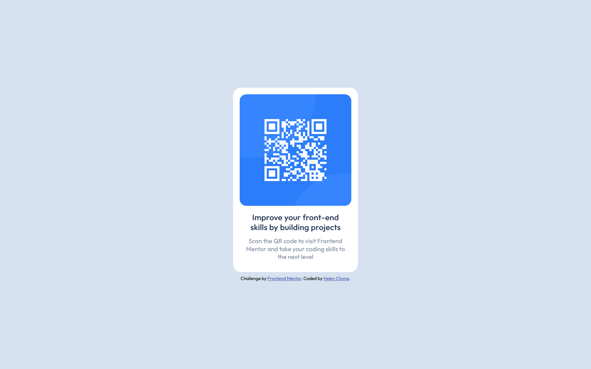

# Frontend Mentor - QR code component solution

This is a solution to the [QR code component challenge on Frontend Mentor](https://www.frontendmentor.io/challenges/qr-code-component-iux_sIO_H). Frontend Mentor challenges help you improve your coding skills by building realistic projects. 

## Table of contents

- [Overview](#overview)
  - [Screenshot](#screenshot)
  - [Links](#links)
- [My process](#my-process)
  - [Built with](#built-with)
  - [What I learned](#what-i-learned)
  - [Continued development](#continued-development)
  - [Useful resources](#useful-resources)
- [Author](#author)
- [Acknowledgments](#acknowledgments)

## Overview

### Screenshot

Desktop:


Mobile:


### Links

- Solution URL: https://www.frontendmentor.io/solutions/mobilefriendly-qr-code-page-using-flexbox-7qc88MuUbG
- Live Site URL: https://helenclx.github.io/Frontend-Mentor-Challenges/qr-code-component/

## My process

### Built with

- Semantic HTML5 markup
- CSS custom properties
- Flexbox

### What I learned

This challenge has been a good exercise for aligning elements and ensuring the component look good on both desktop and mobile devices.

In particular, this CSS snippet will align an element to the center:

```css
body {
  display: flex;
  justify-content: center;
  align-items: center;
}
```

### Continued development

This challenge has been a good exercise in practicing my HTML and CSS skills, and making a web page responsible.

### Useful resources

- [Flexbox Cheat Sheet](https://flexboxcheatsheet.com/) - This helped me for aligning elements by providing CSS snippets.

## Author

- Website - [Helen Chong](https://helenclx.github.io/)
- Frontend Mentor - [@helenclx](https://www.frontendmentor.io/profile/helenclx)

## Acknowledgments

- [Hassia Issah](https://www.frontendmentor.io/profile/Hassiai) for providing feedback to improve my code.