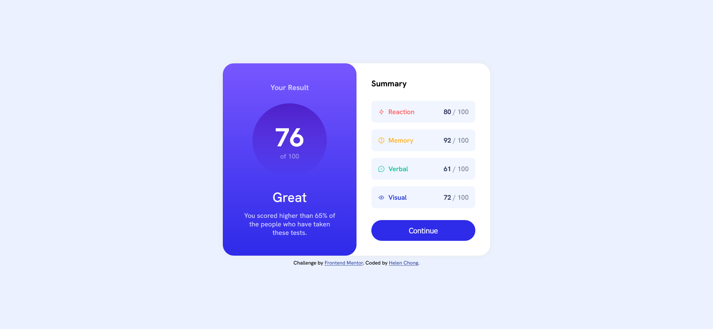

# Frontend Mentor - Results summary component solution

This is a solution to the [Results summary component challenge on Frontend Mentor](https://www.frontendmentor.io/challenges/results-summary-component-CE_K6s0maV). Frontend Mentor challenges help you improve your coding skills by building realistic projects. 

## Table of contents

- [Overview](#overview)
  - [The challenge](#the-challenge)
  - [Screenshot](#screenshot)
  - [Links](#links)
- [My process](#my-process)
  - [Built with](#built-with)
  - [What I learned](#what-i-learned)
  - [Continued development](#continued-development)
  - [Useful resources](#useful-resources)
- [Author](#author)
- [Acknowledgments](#acknowledgments)

## Overview

### The challenge

Users should be able to:

- View the optimal layout for the interface depending on their device's screen size
- See hover and focus states for all interactive elements on the page

### Screenshot

### Links

- Solution URL: https://www.frontendmentor.io/solutions/responsive-results-summary-using-css-grid-and-flexbox-AY52dCLJrO
- Live Site URL: https://helenclx.github.io/Frontend-Mentor-Challenges/results-summary-component/

## My process

### Built with

- Semantic HTML5 markup
- CSS custom properties
- Flexbox
- CSS Grid
- Mobile-first workflow

### What I learned

I got more practice in positioning items with CSS grid and Flexbox.

I also started learning to write CSS with a mobile-first workflow in order to improve my web page layout on mobile devices.

### Continued development

I aim to refine my techniques in positioning items on a web page by using CSS grid and Flexbox.

### Useful resources

- [A Complete Guide to CSS Grid](https://css-tricks.com/snippets/css/complete-guide-grid/) by Chris House
- [Complete CSS Grid Tutorial with Cheat Sheet](https://www.freecodecamp.org/news/css-grid-tutorial-with-cheatsheet/) by Joy Shaheb
- [GRID](https://grid.malven.co/) - A visual cheatsheet for CSS grid layout
- [A Complete Guide to Flexbox](https://css-tricks.com/snippets/css/a-guide-to-flexbox/) by Chris Coyier
- [CSS Flexbox Tutorial with Flexbox Properties Cheat Sheet](https://www.freecodecamp.org/news/css-flexbox-tutorial-with-cheatsheet/) by Joy Shaheb
- [Flexbox Cheat Sheet](https://flexboxcheatsheet.com/)

## Author

- Website - [Helen Chong](https://helenclx.github.io/)
- Frontend Mentor - [@helenclx](https://www.frontendmentor.io/profile/helenclx)

## Acknowledgments

- [Arif Faisal](https://www.frontendmentor.io/profile/arifaisal123) for providing feedback regarding the mobile layout, which helped me in rewriting CSS with mobile-first workflow.