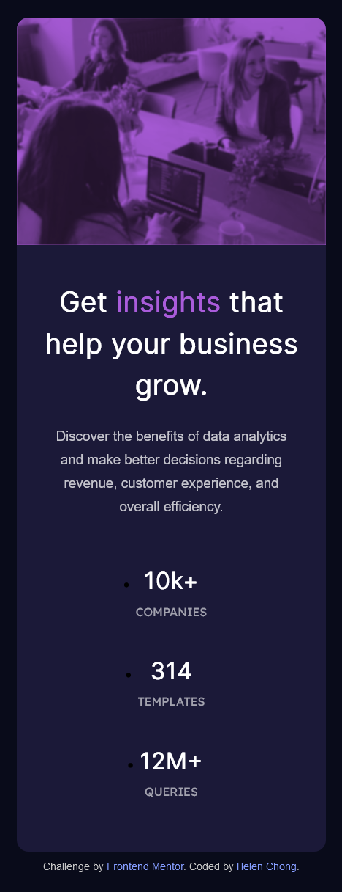

# Frontend Mentor - Stats preview card component solution

This is a solution to the [Stats preview card component challenge on Frontend Mentor](https://www.frontendmentor.io/challenges/stats-preview-card-component-8JqbgoU62). Frontend Mentor challenges help you improve your coding skills by building realistic projects. 

## Table of contents

- [Overview](#overview)
  - [The challenge](#the-challenge)
  - [Screenshot](#screenshot)
  - [Links](#links)
- [My process](#my-process)
  - [Built with](#built-with)
  - [What I learned](#what-i-learned)
  - [Continued development](#continued-development)
  - [Useful resources](#useful-resources)
- [Author](#author)
<!-- - [Acknowledgments](#acknowledgments) -->

## Overview

### The challenge

Users should be able to:

- View the optimal layout depending on their device's screen size

### Screenshot

Desktop:  

Mobile:  

### Links

- Solution URL: https://www.frontendmentor.io/solutions/responsive-stats-preview-card-using-css-grid-and-flexbox-WBtIASipyN
- Live Site URL: https://helenclx.github.io/Frontend-Mentor-Challenges/stats-preview-card-component/

## My process

### Built with

- Semantic HTML5 markup
- CSS custom properties
- Flexbox
- CSS Grid
- Mobile-first workflow

### What I learned

The new learning experience I had from solving this challenge is using the CSS `mix-blend-mode` property to blend an image with background color.

I got to practice using the CSS `order` property to set the order to lay out an item in a flex or grid container, which is useful for responsive web layouts.

### Continued development

I could consider using CSS filters in my web design.

### Useful resources

- [mix-blend-mode - CSS: Cascading Style Sheets](https://developer.mozilla.org/en-US/docs/Web/CSS/mix-blend-mode) by MDN Web Docs
- [order - CSS: Cascading Style Sheets](https://developer.mozilla.org/en-US/docs/Web/CSS/order) by MDN Web Docs

## Author

- Website - [Helen Chong](https://helenclx.github.io/)
- Frontend Mentor - [@helenclx](https://www.frontendmentor.io/profile/helenclx)

<!-- ## Acknowledgments

This is where you can give a hat tip to anyone who helped you out on this project. Perhaps you worked in a team or got some inspiration from someone else's solution. This is the perfect place to give them some credit. -->